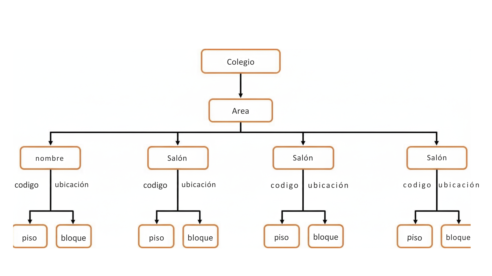

# Cambridge-XML

**Cambridge-XML** es un servicio web intermedio para la gestión y consulta de recursos del Colegio Cambridge, expuesto en formato **XML** sobre API REST. Su función principal es interconectar sistemas, transformar datos entre XML y JSON de manera bidireccional, y ofrecer informes jerárquicos (tipo árbol) que permiten visualización, integración y procesamiento por terceros.

---

## 🚀 PROPÓSITO

- Consumir y exponer datos de Cambridge (salones, oficinas, áreas y empleados) usando XML, a partir de peticiones a un backend original (REST o GraphQL con Spring Boot).
- Facilitar la interoperabilidad entre sistemas que requieren consumir o enviar XML.
- Proveer informes estructurados en formato árbol, listos para integración y análisis externo.

---

## 📁 ESTRUCTURA DEL PROYECTO

```
Cambridge-XML/
├── Dockerfile
├── requirements.txt
├── app/
│   ├── __init__.py
│   └── main.py
└── .github/
    └── workflows/
        └── deployment.yml
```

---

## 🛠️ CÓMO EJECUTAR (DESARROLLO LOCAL)

1. Clona el repositorio:
   ```bash
   git clone https://github.com/tu_usuario/Cambridge-XML.git
   cd Cambridge-XML
   ```

2. Instala dependencias:
   ```bash
   pip install -r requirements.txt
   ```

3. Ejecuta la aplicación:
   ```bash
   cd app
   python main.py
   ```
   La API estará disponible en: http://localhost:5000

---

## 🐳 EJECUCIÓN EN DOCKER

1. Construye la imagen:
   ```bash
   docker build -t cambridge-xml .
   ```

2. Levanta el contenedor:
   ```bash
   docker run -d -p 8094:8094 --name cambridge-xml cambridge-xml
   ```

   **Nota:** Modifica el puerto y la variable `BACKEND_URL` en `main.py` si es necesario.

---

## 🧩 USO BÁSICO

### Ejemplo de POST para crear salón (XML):

**Solicitud:**
```xml
<SalonDTO>
    <codigo>S101</codigo>
    <capacidad>30</capacidad>
</SalonDTO>
```

**POST a:**  
`http://localhost:5000/api/salones`

**Respuesta:**
```xml
<SalonDTO>
    <id>1</id>
    <codigo>S101</codigo>
    <capacidad>30</capacidad>
</SalonDTO>
```

---

## 🌐 ENDPOINTS DISPONIBLES

- `/api/salones`
- `/api/oficinas`
- `/api/empleados`
- `/api/areas`
- `/api/reportes/areas-empleados` (informe jerárquico en XML)
- Métodos soportados: **GET, POST, PUT, DELETE** según recurso

---

## 📊 EJEMPLO DE INFORME XML (ÁRBOL)

```xml
<ReporteAreas>
    <Area>
        <nombre>Matemáticas</nombre>
        <totalEmpleados>10</totalEmpleados>
        <porcentajeProfesores>60</porcentajeProfesores>
        <porcentajeAdministrativos>40</porcentajeAdministrativos>
        <Empleados>
            <item>
                <nombre>Ana</nombre>
                <tipo>Profesor</tipo>
            </item>
            <!-- ... -->
        </Empleados>
    </Area>
    <!-- ... otras áreas ... -->
</ReporteAreas>
```

---

## 💡 APRENDIZAJE INDEPENDIENTE

Se recomienda explorar el código de `main.py` para entender:
- La conversión bidireccional entre XML y JSON utilizando `xmltodict`.
- El orquestador central para peticiones HTTP que abstrae la lógica de comunicación.
- El manejo flexible de endpoints y etiquetas raíz XML para futuras extensiones.

---

## 🔧 TECNOLOGÍAS UTILIZADAS

- **Flask** - Framework web ligero para Python
- **xmltodict** - Librería para conversión entre XML y diccionarios Python
- **requests** - Cliente HTTP para comunicación con el backend
- **Docker** - Containerización para despliegue consistente
- **GitHub Actions** - CI/CD automatizado

---

## 📝 NOTAS TÉCNICAS

- El sistema funciona como proxy/intermediario entre clientes que consumen XML y un backend que expone JSON.
- Todas las transformaciones son transparentes y automáticas.
- El diseño modular permite agregar nuevos endpoints fácilmente.
- Compatible con despliegue en contenedores (Docker) y servicios cloud.

---

## 📊 Diagrama del árbol XML




---


