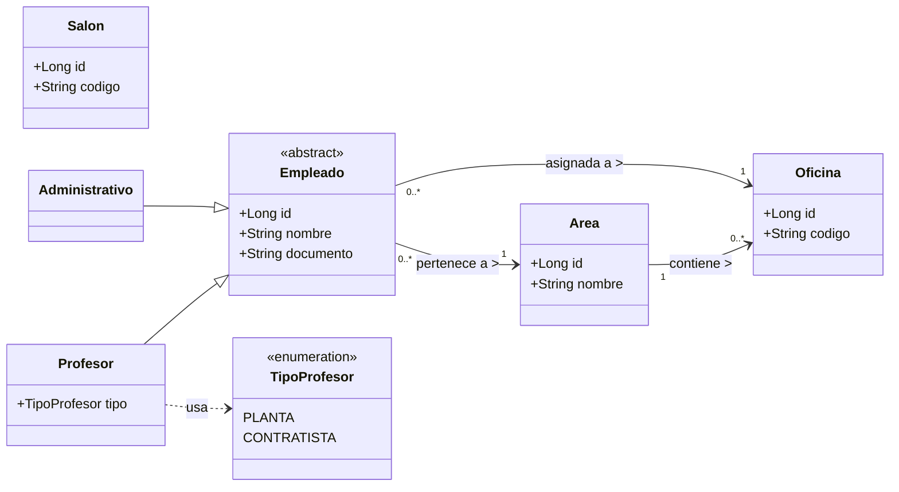
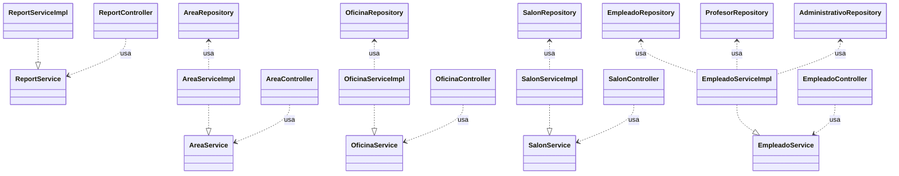

# Colegio Cambridge — Sistema Web

Solución web (Spring Boot + React) para la gestión de **Áreas**, **Oficinas**, **Salones** y **Empleados** del Colegio Cambridge.  
Incluye CRUDs completos, un reporte por área y un frontend en React para interactuar con el backend.

---

##  Objetivo

- Modelar la planta física del colegio (Áreas, Oficinas, Salones).
- Administrar empleados:
  - Cada empleado pertenece a un Área.
  - Cada empleado tiene una Oficina asignada.
  - Los empleados pueden ser **Administrativos** o **Profesores**.
  - Un profesor puede ser de tipo **PLANTA** o **CONTRATISTA**.
- Exponer API REST (CRUD).
- Generar un reporte con totales por área.
- Consumir el backend desde un frontend en React.

---

##  Tecnologías

### Backend
- Java 21
- Spring Boot 3.5.x
- Spring Web, Spring Data JPA, Hibernate
- Base de datos en memoria H2
- Lombok
- Swagger (springdoc-openapi, opcional)

### Frontend
- React 18 + Vite
- Axios
- React Router DOM

---

##  Estructura

```
QuizTwoV2/
│
├── colegio/                ← Backend (Spring Boot)
│   ├── src/main/java/co/cambridge/colegio/
│   │   ├── domain/         ← Entidades JPA
│   │   │   └── enums/      ← TipoProfesor
│   │   ├── repository/     ← Repositorios JPA
│   │   ├── service/        ← Interfaces de servicio
│   │   │   └── impl/       ← Implementaciones
│   │   ├── web/            ← Controladores REST, DTOs, mappers, manejo de errores
│   │   ├── config/         ← Configuración (CORS, DataSeeder)
│   │   └── ColegioApplication.java
│   └── src/main/resources/application.properties
│
└── colegio-frontend/       ← Frontend (React + Vite)
    ├── src/
    │   ├── api/            ← llamadas a backend (axios)
    │   ├── components/     ← Layout
    │   └── pages/          ← Áreas, Oficinas, Salones, Empleados, Reporte
    └── .env                ← VITE_API_BASE=http://localhost:8080
```

---

##  Requisitos

- **JDK 21**
- **Maven 3.9+**
- **Node.js 18+** y **npm**

---

##  Cómo ejecutar

### Backend

`colegio/src/main/resources/application.properties`:

```properties
spring.application.name=colegio
server.port=8080

# H2 en memoria
spring.datasource.url=jdbc:h2:mem:colegio;DB_CLOSE_DELAY=-1;DB_CLOSE_ON_EXIT=FALSE
spring.datasource.driverClassName=org.h2.Driver
spring.datasource.username=sa
spring.datasource.password=

# JPA/Hibernate
spring.jpa.hibernate.ddl-auto=update
spring.jpa.show-sql=true
spring.jpa.properties.hibernate.format_sql=true

# H2 Console
spring.h2.console.enabled=true
spring.h2.console.path=/h2-console

# Perfil dev (DataSeeder + CORS)
spring.profiles.active=dev
```

Arrancar el backend:

```bash
cd Cambridge-API
./mvnw spring-boot:run
```

- API disponible en: `http://localhost:8080/api`
- Consola H2: `http://localhost:8080/h2-console`
  - JDBC URL: `jdbc:h2:mem:colegio`
  - User: `sa`, Password: *(vacío)*

Swagger (si se habilitó):
- UI: `http://localhost:8080/swagger-ui/index.html`
- Docs: `http://localhost:8080/v3/api-docs`

---

### Frontend

Crear archivo `.env` en `colegio-frontend`:

```
VITE_API_BASE=http://localhost:8080
```

Ejecutar:

```bash
cd Cambridge-Web
npm install
npm run dev
```

Abrir en `http://localhost:5173`.

---

##  Endpoints principales

### Áreas `/areas`
| Método | Ruta            | Descripción | Body ejemplo |
|-------:|-----------------|-------------|--------------|
| GET    | `/areas`        | Listar      | —            |
| GET    | `/areas/{id}`   | Obtener     | —            |
| POST   | `/areas`        | Crear       | `{"id":null,"nombre":"Académica"}` |
| PUT    | `/areas/{id}`   | Actualizar  | `{"id":1,"nombre":"Académica"}`    |
| DELETE | `/areas/{id}`   | Eliminar    | —            |

### Oficinas `/oficinas`
| Método | Ruta              | Descripción | Body ejemplo |
|-------:|-------------------|-------------|--------------|
| GET    | `/oficinas`       | Listar      | —            |
| GET    | `/oficinas/{id}`  | Obtener     | —            |
| POST   | `/oficinas`       | Crear       | `{"id":null,"codigo":"O-101","areaId":1}` |
| PUT    | `/oficinas/{id}`  | Actualizar  | `{"id":2,"codigo":"O-102","areaId":1}`    |
| DELETE | `/oficinas/{id}`  | Eliminar    | —            |

### Salones `/salones`
| Método | Ruta            | Descripción | Body ejemplo |
|-------:|-----------------|-------------|--------------|
| GET    | `/salones`      | Listar      | —            |
| GET    | `/salones/{id}` | Obtener     | —            |
| POST   | `/salones`      | Crear       | `{"id":null,"codigo":"S-401"}` |
| PUT    | `/salones/{id}` | Actualizar  | `{"id":1,"codigo":"S-402"}`    |
| DELETE | `/salones/{id}` | Eliminar    | —            |

### Empleados `/empleados`
Body ejemplo:
```json
{
  "nombre": "Laura Méndez",
  "documento": "CC999",
  "areaId": 1,
  "oficinaId": 1,
  "tipoEmpleado": "PROFESOR",
  "tipoProfesor": "PLANTA"
}
```

| Método | Ruta                | Descripción | Notas |
|-------:|---------------------|-------------|-------|
| GET    | `/empleados`        | Listar      | —     |
| GET    | `/empleados/{id}`   | Obtener     | —     |
| POST   | `/empleados`        | Crear       | Valida documento único |
| PUT    | `/empleados/{id}`   | Actualizar  | Cambiar administrativo ↔ profesor |
| DELETE | `/empleados/{id}`   | Eliminar    | —     |

### Reporte `/reportes/areas-empleados`
Ejemplo de respuesta:
```json
[
  {
    "areaId": 1,
    "areaNombre": "Académica",
    "totalEmpleados": 4,
    "totalProfesores": 3,
    "profesoresPlanta": 2,
    "profesoresContratistas": 1,
    "totalAdministrativos": 1
  }
]
```

---

##  Manejo de errores

Formato de error estándar en JSON:

- **404 NOT_FOUND**
```json
{ "error": "NOT_FOUND", "message": "Área no encontrada: 99" }
```

- **400 VALIDATION_ERROR**
```json
{
  "error": "VALIDATION_ERROR",
  "message": "Datos inválidos",
  "fields": { "nombre": "must not be blank" }
}
```

- **400 BAD_REQUEST**
```json
{ "error": "BAD_REQUEST", "message": "Ya existe un área con ese nombre" }
```

---

##  Mejoras posibles

- Paginación y filtros en listas.
- Exportar reporte en CSV.
- Migraciones con Flyway.
- Seguridad (Spring Security).
- Dockerizar backend + frontend.

---

##  Diagramas

### Diagrama de Clases — Modelo de Dominio


### Diagrama de Capas — Servicios, Controladores y Repositorios

